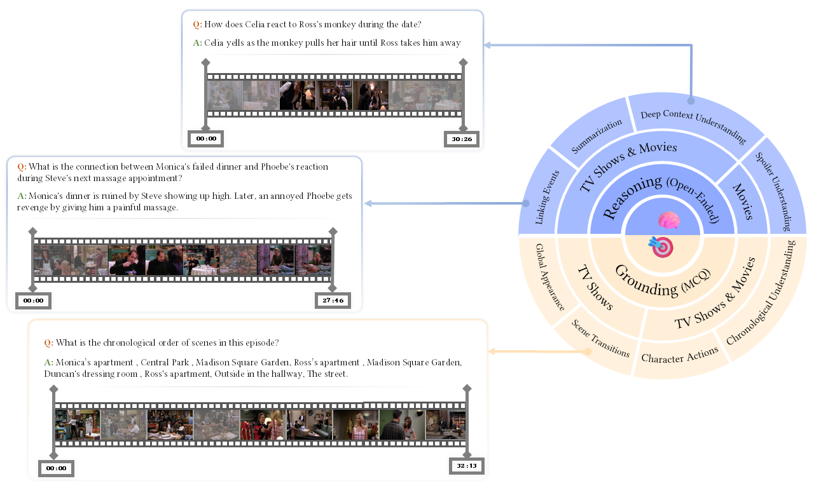
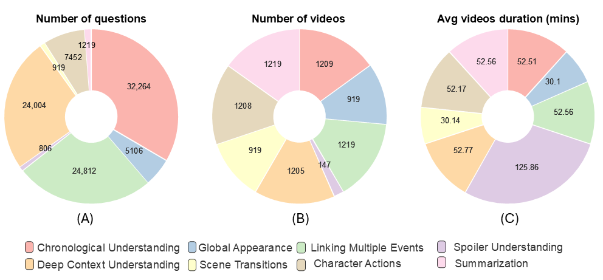
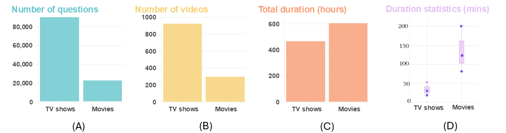
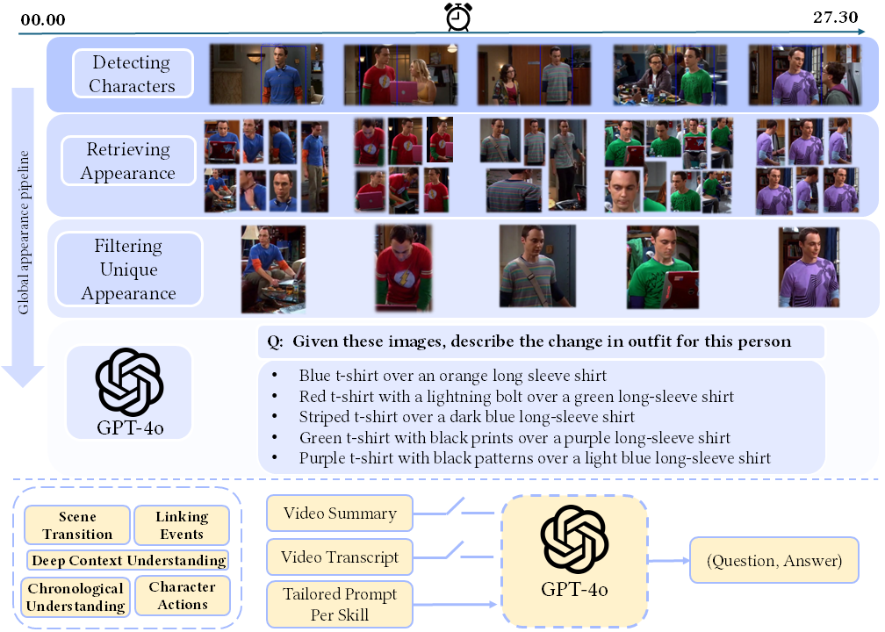

#  InfiniBench: A Benchmark for Large Multi-Modal Models in Long-Form Movies & TV Shows.

<strong>InfiniBench skill set comprising eight skills. The right side represents skill categories and question types, while the left side provides examples of both multiple-choice (MCQ) and open-ended questions.</strong>
# Overview:
Understanding long videos, ranging from tens of minutes to several hours, presents unique challenges in video comprehension. We introduce InfiniBench, a comprehensive benchmark designed to push the limits of extremely long video understanding.
InfiniBench presents **1)The longest** total video duration, exceeding 1,000 hours, with an average of 52.59 minutes per video; **2) The largest** number of question-answer pairs, totaling 111.82 K; **3) Grounding and reasoning questions** that require MVLMs to retrieve, structure, and interpret complex video content while establishing causal relationships; **4) Diverse question types spanning eight distinct skills** and including both multiple-choice and open-ended formats. 
We comprehensively evaluate the state-of-the-art Large Multi-Modality Models on each skill, including commercial models such as GPT-4o and Gemini 1.5 Flash and recent open-source models. 
The results highlight significant challenges, with leading models struggling to achieve high performance.GPT-4o and Gemini 1.5 Flash attained average accuracies of just 49.34\% and 41.99\%, and average scores of 3.25 and 2.79 out of 5, respectively.
Qwen2.5VL is the strongest contender among open-source models, nearing Gemini-1.5-Flash in performance.
# Leaderboard for top commercial and open souce models:
<table>
  <thead>
    <tr>
      <th rowspan="2">Models</th>
      <th rowspan="2">Frame Rate</th>
      <th colspan="4" style="text-align:center; border-bottom: 1px solid #E4EAFF;">Grounding Skills</th>
      <th colspan="4" style="text-align:center; border-bottom: 1px solid #FFF2CC;">Reasoning Skills</th>
      <th rowspan="2">Avg. Acc.</th>
      <th rowspan="2">Avg. Score</th>
    </tr>
    <tr>
      <th>Global Appearance</th>
      <th>Scene Transitions</th>
      <th>Character Actions</th>
      <th>Chronological Understanding</th>
      <th>Summarization</th>
      <th>Deep Context Understanding</th>
      <th>Spoiler Understanding</th>
      <th>Linking Events</th>
    </tr>
  </thead>
  <tbody>
    <tr style="background-color:#92a2fc;">
      <td>Baseline Random</td>
      <td>--</td>
      <td>16.68</td>
      <td>16.66</td>
      <td>16.14</td>
      <td>41.51</td>
      <td>--</td>
      <td>--</td>
      <td>--</td>
      <td>--</td>
      <td>22.20</td>
      <td>--</td>
    </tr>
    <tr>
      <td>GPT-4o</td>
      <td>250 FPV</td>
      <td>44.51</td>
      <td>47.93</td>
      <td>36.07</td>
      <td>68.85</td>
      <td>3.49</td>
      <td>3.39</td>
      <td>2.67</td>
      <td>3.45</td>
      <td>49.34</td>
      <td>3.25</td>
    </tr>
    <tr>
      <td>Gemini-1.5-flash</td>
      <td>-</td>
      <td>42.10</td>
      <td>31.63</td>
      <td>37.82</td>
      <td>56.41</td>
      <td>3.24</td>
      <td>2.55</td>
      <td>2.05</td>
      <td>3.33</td>
      <td>41.99</td>
      <td>2.79</td>
    </tr>
    <tr>
      <td>Qwen2.5VL</td>
      <td>250 FPV</td>
      <td>34.99</td>
      <td>36.45</td>
      <td>35.09</td>
      <td>51.57</td>
      <td>1.26</td>
      <td>2.35</td>
      <td>1.73</td>
      <td>3.15</td>
      <td>39.53</td>
      <td>2.12</td>
    </tr>
    <tr>
      <td>Qwen2VL</td>
      <td>250 FPV</td>
      <td>29.99</td>
      <td>37.54</td>
      <td>36.86</td>
      <td>50.85</td>
      <td>0.67</td>
      <td>2.07</td>
      <td>1.41</td>
      <td>2.76</td>
      <td>38.81</td>
      <td>1.73</td>
    </tr>
    <tr>
      <td>LongVU</td>
      <td>250 FPV</td>
      <td>38.46</td>
      <td>22.69</td>
      <td>28.97</td>
      <td>45.13</td>
      <td>0.20</td>
      <td>1.10</td>
      <td>0.71</td>
      <td>1.37</td>
      <td>33.81</td>
      <td>0.84</td>
    </tr>
    <tr>
      <td>LLaVA-OneVision</td>
      <td>128 FPV</td>
      <td>33.00</td>
      <td>25.02</td>
      <td>24.83</td>
      <td>45.91</td>
      <td>0.49</td>
      <td>1.78</td>
      <td>1.30</td>
      <td>2.51</td>
      <td>32.19</td>
      <td>1.52</td>
    </tr>
    <tr>
      <td>InternLM-XComposer-2.5-OL</td>
      <td>16 FPW</td>
      <td>27.17</td>
      <td>24.37</td>
      <td>30.09</td>
      <td>46.68</td>
      <td>0.37</td>
      <td>1.21</td>
      <td>0.61</td>
      <td>2.03</td>
      <td>32.08</td>
      <td>1.06</td>
    </tr>
    <tr>
      <td>InternVL2.5</td>
      <td>128 FPV</td>
      <td>29.84</td>
      <td>25.35</td>
      <td>26.41</td>
      <td>45.58</td>
      <td>0.65</td>
      <td>1.48</td>
      <td>1.06</td>
      <td>2.22</td>
      <td>31.80</td>
      <td>1.35</td>
    </tr>
     <tr >
      <td>InternVL2</td>
      <td>128 FPV</td>
      <td>24.60</td>
      <td>21.98</td>
      <td>25.00</td>
      <td>44.63</td>
      <td>0.69</td>
      <td>1.68</td>
      <td>1.25</td>
      <td>2.47</td>
      <td>29.05</td>
      <td>1.52</td>
    </tr>
    <tr >
      <td>LLaMA-VID</td>
      <td>1 FPS</td>
      <td>17.37</td>
      <td>17.06</td>
      <td>18.25</td>
      <td>41.74</td>
      <td>1.58</td>
      <td>2.00</td>
      <td>1.49</td>
      <td>2.40</td>
      <td>23.61</td>
      <td>1.87</td>
    </tr>
    <tr>
      <td>Goldfish</td>
      <td>45 FPW</td>
      <td>10.30</td>
      <td>2.82</td>
      <td>20.87</td>
      <td>40.14</td>
      <td>0.77</td>
      <td>2.36</td>
      <td>1.85</td>
      <td>3.01</td>
      <td>18.53</td>
      <td>2.00</td>
    </tr>
    <tr>
      <td>MiniGPT4-video</td>
      <td>45 FPV</td>
      <td>2.33</td>
      <td>1.09</td>
      <td>2.36</td>
      <td>39.86</td>
      <td>0.05</td>
      <td>0.54</td>
      <td>0.75</td>
      <td>0.89</td>
      <td>11.41</td>
      <td>0.56</td>
    </tr>
  </tbody>
</table>
<p><strong>InfiniBench leaderboard</strong> across eight skills. FPV (Frames Per Video), FPS (Frames Per Second), and FPW (Frames Per Window) are reported. All models in this evaluation utilize <strong>subtitles</strong>.</p>

# Benchmark statistics:

<strong>InfiniBench skills statistics. (A) Number of questions per skill, (B) Number of videos per skill, and (C) Average video duration per skill</strong>
# Videos source statistics:

<strong>Comparison between TV shows and Movies. (A) shows the number of questions, (B) represents the number of videos, (C) represents the Total video durations, and (D) shows The Minimum, Maximum, and average video duration for each video source</strong>

# How to download videos 
1- TVQA videos <br>
Download the original TVQA videos for short videos from [here](https://tvqa.cs.unc.edu/download_tvqa.html)<br>
Run the following commmand to convert the videos to long-form videos.<br>
```python
python videos_preprocessing/convert_tvqa_from_short_to_long.py --train_path "path to the training annotation" --val_path "path to the validation annotation" --root_dir "path to the short clips directory" --full_videos_dir "path to save the full video episodes"
```
this script will output the full video episodes in the full_videos_dir and json annotations for only the validation data called "tvqa_val_edited.json" that will be used as a local questions later. <br>

To get the video .mp4 files 
Run the following script or  [Download](https://huggingface.co/datasets/vlv-bench/VLV-Benchmark/tree/main/tvqa_mp4_videos_tar_files)
```python
python videos_preprocessing/convert_to_mp4_format.py --video_frames_dir "path to the long videos frames" --output_dir "path to save the MP4 videos" --source "tvqa" --fps 3 
```
You can download the TVQA subtitles from here[Download](https://huggingface.co/datasets/vlv-bench/VLV-Benchmark/blob/main/tvqa_subtitles.zip) <br>
2- MovieNet Data <br>
Dowlnoad the original MovieNet data from [here](https://opendatalab.com/OpenDataLab/MovieNet/tree/main/raw) <br>
Filter out the movies that doesn't have shot subtitles<br>
Run the following script to filter movienet<br>
```python
python filter_movienet.py
```
To get the video .mp4 files 
Run the following script to the raw data or download our version from huggingface [Download_full_length](https://huggingface.co/datasets/vlv-bench/VLV-Benchmark/tree/main/Movienet_mp4_videos_full_length) or [Download_1fps](https://huggingface.co/datasets/vlv-bench/VLV-Benchmark/tree/main/Movienet_mp4_videos_1fps)
```python
# to generare movies with the original frame rate use original_fps = True
python videos_preprocessing/convert_to_mp4_format.py --video_frames_dir "path to the long videos frames" --output_dir "path to save the MP4 videos" --source "movienet" --original_fps --movies_has_subtitles "movies_has_subtitles.json" --movies_durations "movies_durations.json" 
# to generate movies with 1 fps use original_fps = False and fps = 1 but take care that the video duration will be different from the original duration 
python videos_preprocessing/convert_to_mp4_format.py --video_frames_dir "path to the long videos frames" --output_dir "path to save the MP4 videos" --source "movienet" --fps 1 --movies_has_subtitles "movies_has_subtitles.json" --movies_durations "movies_durations.json" 
```
# Annotation files 
You can find the annotation files for the 8 skills in huggingface datasets format [here](https://huggingface.co/datasets/vlv-bench/VLV-Benchmark/tree/main/Benchmark_annotations)
# How to re-create the Benchmark  

<strong>Full annotation pipeline for InfiniBench skill set. The upper section depicts the global appearance pipeline, while the lower section illustrates the question generation using GPT-4o. The gates for video summary and video transcript indicate that some skills utilize only the summary, others use only the transcript, and some use both.</strong>
## Prepare the data sources
### Data scrapping 
1) We scrapped the all the TVQA summaries from IMDB. 
2) We scrapped the all the MovieNet summaries from IMDB. 
3) We scrapped the transcripts for all the TVQA videos. 
5) We filtered out scripts for the movies that doesn't have shot subtitles from the MovieNet data.
6) We filtered out scripts for the edpisodes that doesn't exist in Long TVQA.
7) We scrapped the the spoiler questions for all the movies in movieNet.
8) We scrapped the movies durations from IMDB.
9) We scrapped the TV shows Main cast from IMDB for the global appearance skill.

You can see the code for scrapping the data from IMDB [here](https://github.com/vlv-bench/VLV-Bench/tree/main/scrapping) but don't need to re-run it as we provide the filtered data in the benchmark sources.
### Bechmark sources : 
1) TVQA and MovieNet filtered summaries and scripts. [Download](https://huggingface.co/datasets/vlv-bench/VLV-Benchmark/tree/main/sources)
## Annotation pipeline
### Global appearance <br>
1) Use Yolo 11 to detect the characters in the videos.
2) for each detected character, do face matching with the main cast of the TV shows to get the character name.
3) Filter the characters appearance in separate folders by running the following script.
```python
cd global_apprerance/tvqa
bash Run_full_pipeline.sh
```
1) Remove the redundant images from the folders using Dino-V2 similarity.
2) Run the following script to get the descriptions for the remaining images (GPT-4o will take care if any duplicates remains, it can skip them and only choose the unique outfits).
```python 
python gpt4_description.py --data_path "path to the unique images folder" --output_path "path to the output folder" --api_key "GPT-4o API key"
```
1) Run the following script for question generation.
```python
python questions_generation/tvqa/global_apperance_qa_generation.py --gpt4_descriptions "path to the json file with the descriptions" --existed_episodes "existed_videos_tvqa.json"
```
### Scene transition 
```python 
python GPT-4/tvqa/python scene_transitions.py --api_key "GPT-4 API key" --scripts_folder "path to the episodes scripts folder" --output_dir "path to the output directory" --output_json "path to the output json file" --num_tasks 64
# for question generation run the following script
python questions_generation/tvqa/scene_transition_qa_generation.py --gpt4_output "path to the output json file" --existed_episodes "existed_videos_tvqa.json"
```
### Squence of character actions 
For TVQA 
```python 
python GPT-4/tvqa/character_actions.py --api_key "GPT-4 API key" --scripts_folder "path to the episodes scripts folder" --summaries_folder "path to the summaries folder" --output_dir "path to the output directory" --output_json "path to the output json file" --num_tasks 64

# for question generation run the following script
python questions_generation/tvqa/character_actions_mcq.py --gpt4_output "path to the output json file" 
```
For MovieNet 
```python 
python GPT-4/movienet/character_actions.py --api_key "GPT-4 API key" --scripts_folder "path to the movies scripts folder" --summaries_folder "path to the movies summaries folder" --output_dir "path to the output directory" --output_json "path to the output json file" --num_tasks 64
# for question generation run the following script
python questions_generation/movienet/character_actions_mcq_movienet.py --gpt4_output "path to the output json file" 
```
### Deep context understanding 
For TVQA 
```python 
python GPT-4/tvqa/context_understanding.py --api_key "GPT-4 API key" --scripts_folder "path to the episodes scripts folder" --summaries_folder "path to the summaries folder" --output_dir "path to the output directory" --output_json "path to the output json file" --num_tasks 64

# for question generation run the following script
python questions_generation/tvqa/context_understanding.py --gpt4_output "path to the output json file" 
```
For MovieNet 
```python 
python GPT-4/movienet/context_understanding.py --api_key "GPT-4 API key" --scripts_folder "path to the movies scripts folder" --summaries_folder "path to the movies summaries folder" --output_dir "path to the output directory" --output_json "path to the output json file" --num_tasks 64
# for question generation run the following script
python questions_generation/movienet/context_understanding.py --gpt4_output "path to the output json file" 
```
### Linking multiple events 
For TVQA 
```python 
python GPT-4/tvqa/linking_events.py --api_key "GPT-4 API key"  --summaries_folder "path to the summaries folder" --output_dir "path to the output directory" --output_json "path to the output json file" --num_tasks 64

# for question generation run the following script
python questions_generation/tvqa/linking_events.py --gpt4_output "path to the output json file" 
```
For MovieNet 
```python 
python GPT-4/movienet/linking_events.py --api_key "GPT-4 API key"  --summaries_folder "path to the movies summaries folder" --output_dir "path to the output directory" --output_json "path to the output json file" --num_tasks 64
# for question generation run the following script
python questions_generation/movienet/linking_events.py --gpt4_output "path to the output json file" 
```
### Chronological Understanding 
For TVQA 
```python 
python GPT-4/tvqa/temporal_events.py --api_key "GPT-4 API key" --scripts_folder "path to the episodes scripts folder" --output_dir "path to the output directory" --output_json "path to the output json file" --num_tasks 64

# for question generation run the following script
python questions_generation/tvqa/temporal_events_qa_generation.py --gpt4_output "path to the output json file" 
```
For MovieNet 
```python 
python GPT-4/movienet/temporal_events.py --api_key "GPT-4 API key" --scripts_folder "path to the movies scripts folder" --output_dir "path to the output directory" --output_json "path to the output json file" --num_tasks 64
# for question generation run the following script
python questions_generation/movienet/temporal_events_qa_generation.py --gpt4_output "path to the output json file" 
```
### Movies spoiler questions 
```python 
python questions_generation/spoiler_questions.py --scrapped_spoiler_questions "path to the scrapped spoiler questions"
```
### Summarization 
```python
python questions_generation/summarization_skill.py --summarization_movienet_json "path to json file of movienet summaries" --summarization_tvqa_json "path to json file of tvqa summaries" --api_key "GPT-4 API key"
```

# Evaluation
To use our evaluation scrip for accuracy and GPT4 score you should prepare each skill prediction file in the following format.
```python 
# for multiple choice questions
[
    {"Q":"question",  "A","answer", "pred":"model_pred","options_str":"option 0 : option sentence \n option 1 option sentence \n ...","answer_idx":"correct option index"}  ,
    {"Q":"question",  "A","answer", "pred":"model_pred","options_str":"option 0 : option sentence \n option 1 option sentence \n ...","answer_idx":"correct option index"}  ,
    {"Q":"question",  "A","answer", "pred":"model_pred","options_str":"option 0 : option sentence \n option 1 option sentence \n ...","answer_idx":"correct option index"}  ,
    ... 
]

# for open ended questions 
[
    {"Q":"question",  "A","answer", "pred":"model_pred"}  ,
    {"Q":"question",  "A","answer", "pred":"model_pred"}  ,
    {"Q":"question",  "A","answer", "pred":"model_pred"}  ,
    ... 
]

```
Then run the following script for accuracy evaluation for the skills that has multiple choice questions 
```bash
# set the parameters in the script
bash evaluation/GPT4_eval/gpt4_accuracy.sh 
```
For the skills that has open-ended questions run the following script to get the GPT4 score
```bash
# set the parameters in the script
bash evaluation/GPT4_eval/gpt4_score.sh 
```

# Acknowledgements
[Video-ChatGPT](https://mbzuai-oryx.github.io/Video-ChatGPT)<br>
[InsightFace](https://github.com/deepinsight/insightface/tree/master/python-package)<br>
[Yolo-11](https://github.com/ultralytics/ultralytics)<br>
# License
This repository is under [BSD 3-Clause License](LICENSE.md).

